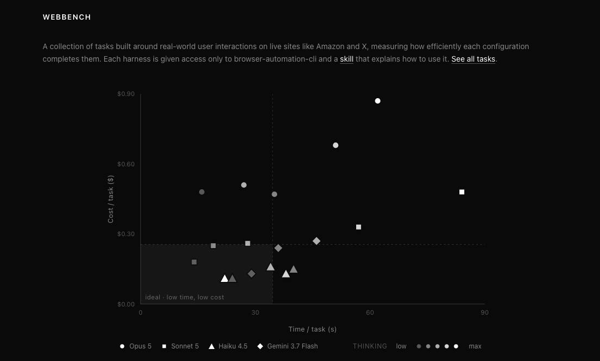
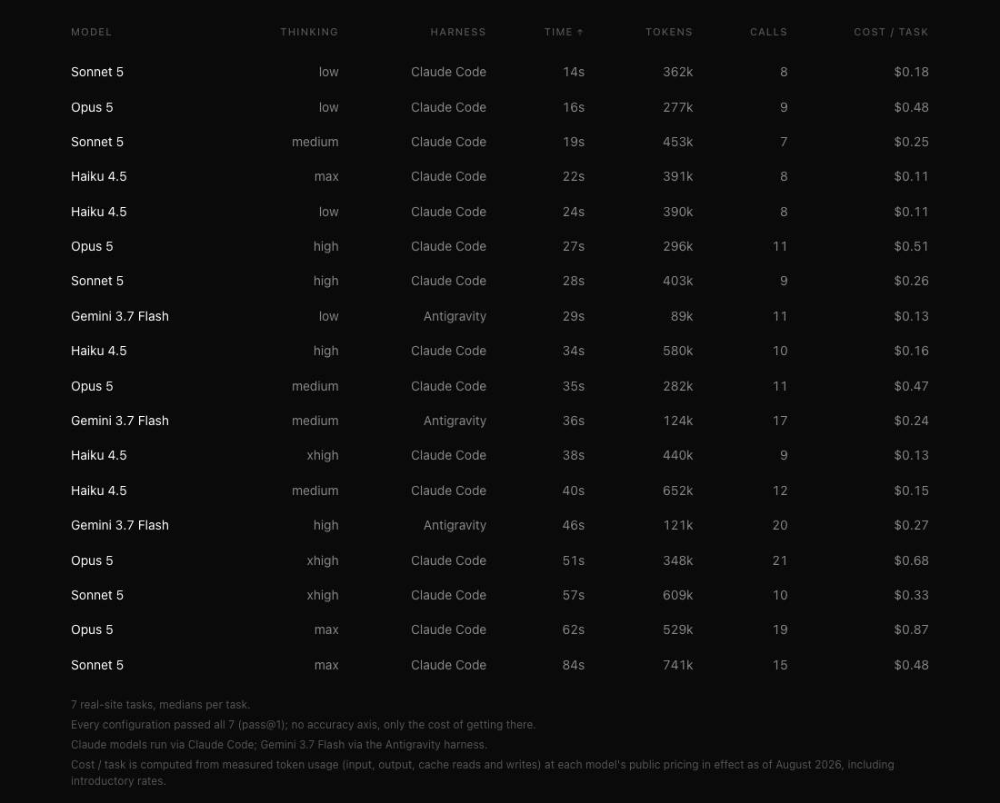

# web-bench

A benchmark for **how efficiently an LLM drives a browser** on real websites. Every configuration gets
the same browser tool and the same 7 tasks on live sites; the benchmark measures the **cost of success**, time, tokens, tool calls, and dollars per task, not accuracy (every configuration passes).

18 configurations: **Claude** (Opus 5 / Sonnet 5 / Haiku 4.5 × five thinking levels) via Claude Code, and
**Gemini 3.7 Flash** (three levels) via Antigravity. 18 × 7 tasks, pass@1.

## Results

Every configuration passed all 7 tasks, so the axes are **time vs cost**: the efficiency frontier.





Per-task result JSONs are published under [`results/`](results/); `cost` is derived from measured token
usage (input, output, cache) at each model's public pricing.

## Tasks

| task | kind | site | what it tests |
|---|---|---|---|
| `mlb_latest` | read | ESPN / MLB | latest scores, then drill into a box score |
| `hn_summary` | read | Hacker News | read the front page and synthesize a themed digest |
| `weather_nyc` | read | weather.gov | navigate to a current forecast |
| `x_projects` | read | x.com + linked article | multi-hop: profile → project links → read an article |
| `amazon_cart` | action | amazon.ca | open two products → add both to cart |
| `amazon_search_add` | action | amazon.ca | search → open a result → add to cart |
| `pixel_click` | action | local canvas | vision + raw-pixel clicking (`click --at X,Y`) |

Each task has its own directory under [`tasks/`](tasks/) with the verbatim `prompt.txt` (the runtime
source), a `task.md` (kind, site, what it tests, verdict), and a `verifier.md` explaining exactly how the
run is scored. Read tasks target **current** data (unanswerable from training, the agent must navigate
and read); `pixel_click` is checked programmatically by the canvas server, and the rest are graded by an
LLM judge (Claude) offline from the captured evidence.

## Methodology

- **Capture-first.** Each run writes a durable raw bundle, full model trace, end-state evidence,
  screenshots, token usage, and a headless video, *before* any judging, so verdicts can be re-derived
  offline without ever re-running the models.
- **Held constant.** Same tasks, same browser tool, same session setup, same turn limit across every
  configuration; only the model, thinking level, and the harness exposing it vary.
- **Pretraining-proof.** Current-data reads + state-change verification + a navigate-don't-recall
  instruction in every prompt, with every browser call captured (an answer with no navigation fails).

## Running it

Needs the `browser` CLI ([browser-automation-cli](https://github.com/jshan9078/browser-automation-cli),
the fixed browser tool) plus the Claude and/or Antigravity CLI. Put a `CLAUDE_CODE_OAUTH_TOKEN` in a
`.env` at the repo root.

```bash
uv tool install browser-automation-cli   # the browser tool under test
python3 harness.py tasks                 # list tasks + prompts
./run_matrix.sh                          # run the full matrix (captures raw bundles)
python3 harness.py score                 # derive metrics into results/
python3 harness.py report                # print the results table
```

## Layout

| path | what it is |
|---|---|
| `tasks/<name>/` | one directory per task: `prompt.txt` (source of truth), `task.md`, `verifier.md` |
| `harness.py` | runner, offline scoring, and the report table (loads prompts from `tasks/`) |
| `run_matrix.sh`, `run_one.sh`, `agy_one.sh` | run scripts (Claude via `claude -p`, Gemini via `agy -p`) |
| `record_cdp.py` | headless CDP screencast recorder (per-run video) |
| `pixelapp/` | the local canvas app for `pixel_click` |
| `dashboard.py` | builds an HTML results dashboard from `results/` |
| `results/` | published per-task result JSONs |
| `raw/` | local run artifacts, traces, videos, screenshots (git-ignored) |
